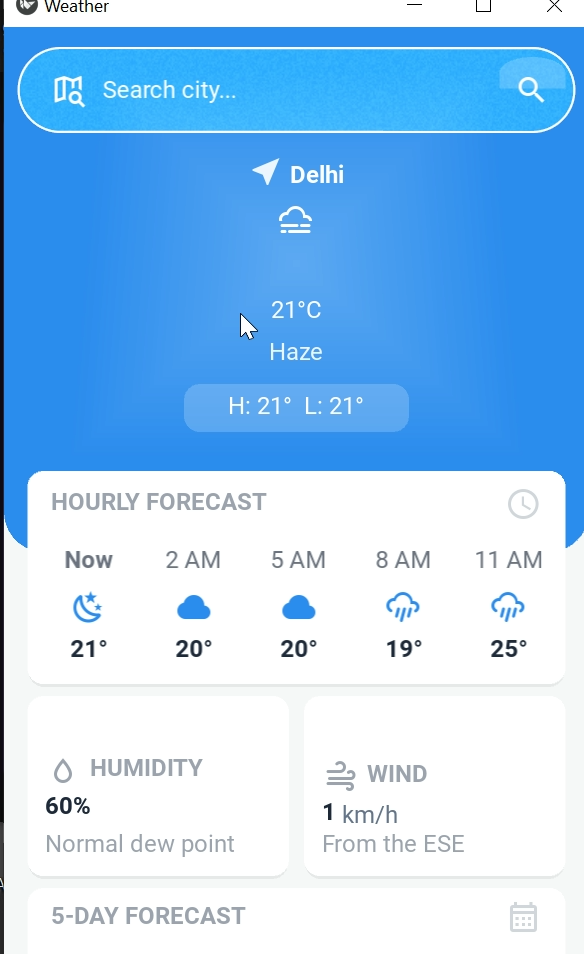

# Weather App

A modern, responsive weather application built with Python and KivyMD that provides real-time weather information with a beautiful Material Design interface.

## 🌟 Features

- **Real-time Weather Data**: Fetches current weather information from OpenWeatherMap API
- **Beautiful UI**: Material Design components with smooth animations
- **Loading States**: Elegant loading overlay during data fetching
- **Error Handling**: User-friendly error messages with retry functionality
- **Responsive Design**: Works on desktop and mobile platforms
- **Search Functionality**: Search weather for any city worldwide

## 📸 Screenshot



## 🚀 Getting Started

### Prerequisites

- Python 3.8 or higher
- UV package manager (recommended) or pip

### Installation

1. **Clone the repository**

   ```bash
   git clone <repository-url>
   cd weather-app
   ```

2. **Install dependencies using UV**

   ```bash
   uv sync
   ```

   Or using pip:

   ```bash
   pip install -r requirements.txt
   ```

3. **Set up environment variables**

   Create a `.env` file in the root directory:

   ```
   OPENWEATHER_API_KEY=your_api_key_here
   ```

   Get your free API key from [OpenWeatherMap](https://openweathermap.org/api)

4. **Run the application**
   ```bash
   uv run main.py
   ```

## 🏗️ Project Structure

```
weather-app/
├── main.py                 # Main application entry point
├── components/             # UI components
│   ├── Details.py          # Weather details display
│   ├── TopBar.py           # Application header
│   ├── Loading.py          # Loading overlay
│   ├── Api.py              # API integration
│   └── utility.py          # Utility functions
├── components/kv/          # KV language files
│   └── Section.py          # UI layout definitions
├── assets/                 # Application assets
├── screenshot/             # Application screenshots
├── .env                    # Environment variables
├── pyproject.toml          # Project configuration
└── README.md               # This file
```

## 🎨 UI Components

### Main Features

- **TopBar**: Application header with title and navigation
- **Details Section**: Displays comprehensive weather information including:
  - Temperature and feels-like temperature
  - Weather conditions and descriptions
  - Humidity and pressure
  - Wind speed and direction
  - Visibility and cloud coverage
- **Loading Overlay**: Semi-transparent overlay with circular progress indicator
- **Toast Notifications**: Success and error messages with retry functionality

### Design Principles

- Material Design 3 guidelines
- Smooth animations and transitions
- Responsive layout adaptation
- Accessibility considerations

## 🔧 Technical Details

### Technologies Used

- **KivyMD**: Material Design components for Kivy
- **Kivy**: Cross-platform GUI framework
- **Requests**: HTTP library for API calls
- **Python 3.12**: Core programming language

### API Integration

- **OpenWeatherMap API**: Real-time weather data
- **Async/Await**: Non-blocking API calls
- **Error Handling**: Comprehensive error management
- **Retry Logic**: Automatic retry functionality

### Architecture

- **Component-based**: Modular UI components
- **Event-driven**: Responsive user interactions
- **Separation of Concerns**: Clean code organization
- **State Management**: Efficient data handling

## 🌍 About

This Weather App was created as a demonstration of modern Python desktop application development using KivyMD. It showcases best practices in:

- **User Experience**: Intuitive interface with clear visual feedback
- **Performance**: Efficient data fetching and smooth animations
- **Code Quality**: Clean, maintainable, and well-documented code
- **Design**: Beautiful Material Design implementation

The app provides essential weather information in a clean, user-friendly interface that works across different platforms and screen sizes.

## 📝 License

This project is open source and available under the [MIT License](LICENSE).

## 🤝 Contributing

Contributions are welcome! Please feel free to submit a Pull Request. For major changes, please open an issue first to discuss what you would like to change.

## 📞 Support

If you encounter any issues or have questions, please open an issue on the GitHub repository.

---

**Made with ❤️ using Python and KivyMD**
